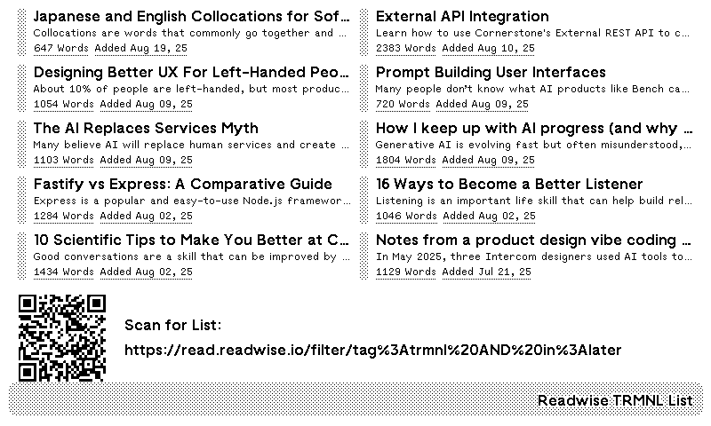

A plugin that displays items from the Readwise Reader account associated with the API Key.

Items should be in the `later` list, and tagged with `trmnl` to work.

Readwise filter query string: `tag:trmnl AND in:later`